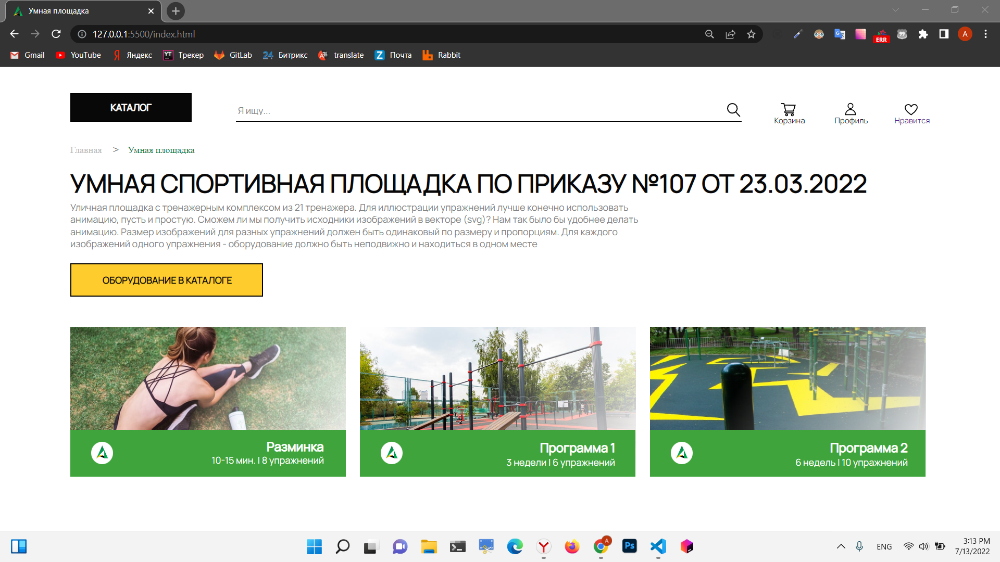
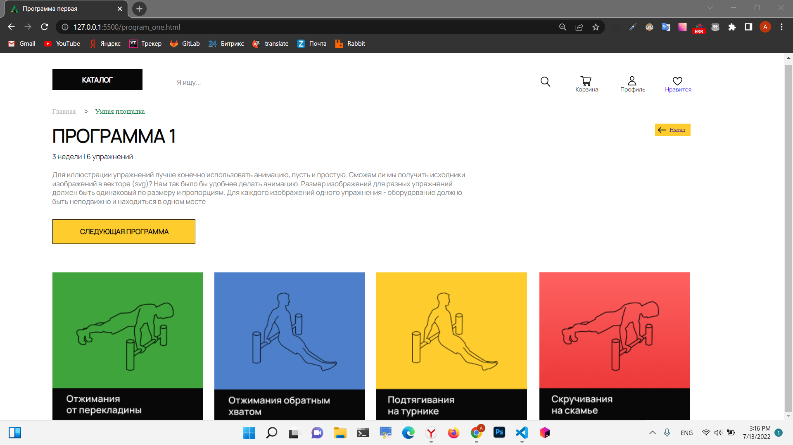
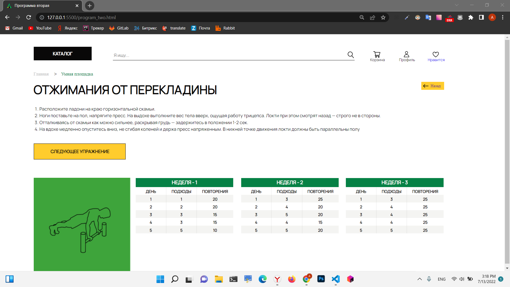

# Swipe & Like


# Инструкция по запуску:

### 1. Склонируй проект ```git@github.com:Lexlife/swipe_and_like.git```.

### 2. Установи зависимости ```npm i```.

### 3. Введи в терминале Bash команду ```npm start```.

# Сайт состоит из 3-х страниц:

### Первая страница:


### Вторая страница:


### Третья страница:
